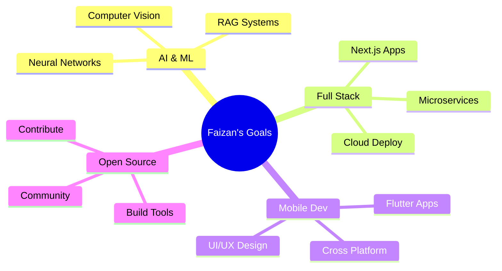

<div align="center">

<!-- Animated Header -->


<!-- Animated Typing Effect -->
<p align="center">
  
</p>

<!-- Badges -->
<p align="center">
  
  
  
  
</p>

</div>

<!-- Animated Divider -->


##  About Me


```javascript
const faizan = {
    pronouns: "He" | "Him",
    location: "Pakistan 🇵🇰",
    languages: ["JavaScript", "Python", "C++", "C#", "Dart"],
    
    currentFocus: {
        primary: "AI & Machine Learning",
        secondary: "Full Stack Development",
        exploring: "RAG Technology & Neural Networks"
    },
    
    expertise: {
        frontend: ["React", "Next.js", "Flutter"],
        backend: ["Node.js", "Express", ".NET", "FastAPI"],
        databases: ["MongoDB", "MySQL", "PostgreSQL", "Firebase"],
        ai_ml: ["TensorFlow", "PyTorch", "Scikit-Learn"]
    },
    
    currentProject: "Attend Track - Attendance Management System",
    lifePhilosophy: "Code with passion, debug with patience",
    funFact: "I turn coffee into code! ☕️→💻"
};
```

<br clear="right"/>

**🎯 Quick Highlights:**
- 🔭 Working on AI/ML projects with real-world applications
- 🌱 Mastering Deep Learning & Advanced Neural Networks
- 💡 Passionate about building scalable, user-centric solutions
- 🤝 Open to collaborating on innovative tech projects
- 📫 Reach me: **ranafaizaan03@gmail.com**

<!-- Animated Divider -->


##  Tech Stack & Expertise

<div align="center">

### 🎨 Frontend Universe
<p>
  
</p>

### ⚙️ Backend Powerhouse
<p>
  
</p>

### 🗄️ Database & Cloud
<p>
  
</p>

### 🤖 AI & Machine Learning
<p>
  
  
  
  
</p>

### 🛠️ Tools & Platforms
<p>
  
  
</p>

</div>

<!-- Animated Divider -->


##  GitHub Analytics

<div align="center">

### 📈 Performance Metrics

<table>
  <tr>
    <td>
      
    </td>
    <td>
      
    </td>
  </tr>
</table>

### 💻 Coding Activity


### 🏆 Achievement Showcase


### 📊 Language Distribution


</div>

<!-- Animated Divider -->


##  Featured Project

<div align="center">

### 🎯 Attend Track - Smart Attendance Management

<a href="https://github.com/faizan-03/Attendence-Sytem-for-class-Generic">
  
</a>

**A comprehensive Flutter application revolutionizing student attendance management**

```yaml
🚀 Tech Stack: Flutter • Dart • Hive Database • Provider State Management
✨ Features: Course Management • Student Tracking • PDF Reports • Modern UI/UX
📱 Platform: Android (iOS Ready)
🎨 Design: Material Design 3 • Responsive Layout • Intuitive Navigation
```

<a href="https://github.com/faizan-03/Attendence-Sytem-for-class-Generic">
  
</a>

</div>

<!-- Animated Divider -->


##  Let's Connect & Collaborate

<div align="center">

### 🌐 Find Me Across The Web

<table>
  <tr>
    <td align="center" width="200">
      <a href="https://linkedin.com/in/rana-faizan-7b4b02252">
        <br>
        
      </a>
    </td>
    <td align="center" width="200">
      <a href="mailto:ranafaizaan03@gmail.com">
        <br>
        
      </a>
    </td>
    <td align="center" width="200">
      <a href="https://twitter.com/rana_faizan_001">
        <br>
        
      </a>
    </td>
  </tr>
  <tr>
    <td align="center" width="200">
      <a href="https://instagram.com/ranafaizan__03">
        <br>
        
      </a>
    </td>
    <td align="center" width="200">
      <a href="https://fb.com/ranafaizan.ranafaizan.7355">
        <br>
        
      </a>
    </td>
    <td align="center" width="200">
      <a href="https://github.com/faizan-03">
        <br>
        
      </a>
    </td>
  </tr>
</table>

### 💼 Open For Opportunities

<p>
  
  
  
</p>

</div>

<!-- Animated Divider -->


## 💭 Developer Wisdom

<div align="center">


### 🎯 My Coding Principles

> **Clean Code** • **Scalable Architecture** • **User-Centric Design** • **Continuous Learning**

</div>

<!-- Animated Divider -->


## 🎯 Current Focus & Goals

<div align="center">



</div>

<table align="center">
  <tr>
    <td align="center">🔭 <b>Building</b></td>
    <td>AI-powered applications with cutting-edge RAG technology</td>
  </tr>
  <tr>
    <td align="center">🌱 <b>Learning</b></td>
    <td>Advanced Neural Networks, Deep Learning & Cloud Architecture</td>
  </tr>
  <tr>
    <td align="center">👯 <b>Collaborating</b></td>
    <td>Open to exciting Full-Stack, AI/ML, and Mobile projects</td>
  </tr>
  <tr>
    <td align="center">💬 <b>Ask Me</b></td>
    <td>Web Dev, Mobile Apps, AI/ML, Database Design, System Architecture</td>
  </tr>
  <tr>
    <td align="center">⚡ <b>Fun Fact</b></td>
    <td>I believe every problem has an elegant solution in code!</td>
  </tr>
</table>

<!-- Animated Divider -->


<div align="center">

### 🌟 *"Building the future, one commit at a time"* 🚀

<p>
  
</p>

**Thanks for visiting! Let's build something amazing together! ✨**


</div>
